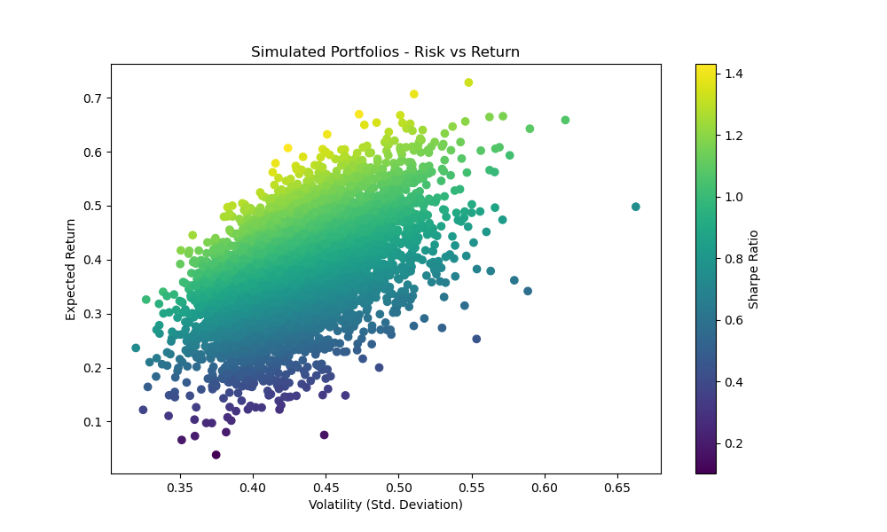

# portfolio-optimization-tool
A Python-based financial modeling tool that simulates and optimizes investment portfolios using Sharpe Ratio analysis.

# 📈 Portfolio Optimization Tool

This project simulates 5,000 investment portfolios using historical stock price data to identify the portfolio with the highest Sharpe Ratio (best risk-adjusted return).

## 🔍 Project Overview

- ✅ Pulls 5 years of price data from Yahoo Finance using `yfinance`
- 📊 Calculates annualized returns, risk, and Sharpe ratios
- 🧪 Simulates thousands of random portfolios with varied allocations
- 🔎 Optimizes the portfolio using `scipy.optimize` to maximize Sharpe Ratio
- 🎯 Visualizes the Efficient Frontier

## 📊 Chart Output

## 💡 Optimal Portfolio (Example)

| Ticker | Weight |
|--------|--------|
| AAPL   | 0.22   |
| TSLA   | 0.18   |
| NVDA   | 0.15   |
| ...    | ...    |

*(Weights are illustrative. See `optimal_portfolio.csv` for actual results.)*

## 🛠️ Technologies Used

- Python
- pandas, numpy
- matplotlib
- yfinance
- scipy

## 🧠 Business Relevance

This project mirrors the risk-adjusted portfolio modeling strategies used by firms like Fidelity to help clients make smarter investment decisions. It highlights your ability to integrate data analytics and financial modeling — valuable for roles in digital wealth planning, investment analytics, or FinTech.

## 📁 Files

- `portfolio_optimization.ipynb` – All project code and outputs
- `optimal_portfolio.csv` – Final portfolio weights
- `efficient_frontier.png` – Visualization of simulated portfolios
